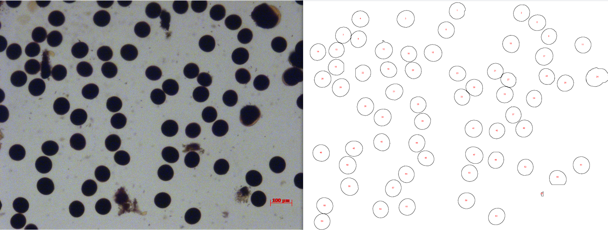

# 🌸 Pollen Diameter Calculator / 花粉直径计算器
# Pollen Diameter Batch Tool (ImageJ Macro)

[中文说明](#花粉粒直径批量统计工具imagej-宏)

This is a batch image-analysis macro for ImageJ / Fiji. It detects round black fertile pollen grains in microscope images, measures grain area, converts area to equivalent circular diameter, and exports Excel-readable CSV tables.

Script file:

```text
Pollen_Diameter_Batch.ijm
```

## Example

The example below shows an original pollen(rice) image with the generated outline preview.



## Features

- Batch-process pollen images from one input folder.
- Use one fixed scale-bar calibration for the whole batch.
- Allow manual scale input when automatic scale detection is unreliable.
- Calculate equivalent circular diameter from measured area.
- Filter pollen candidates by circularity, default `Circularity = 0.70-1.00`.
- Exclude nonblack candidates with an adjustable black-color filter.
- Filter objects outside the valid diameter range, default `20-100 um`.
- Export a main result table, particle detail table, summary table, and debug log.
- Optionally save outline preview images for visual quality control.

## Requirements

- [ImageJ official download](https://imagej.net/ij/download.html) or [Fiji official download](https://imagej.net/software/fiji/downloads)

This tool is not a Python program. It is an ImageJ macro script with the `.ijm` extension.


## Usage
You need to download ImageJ at first
1. Open ImageJ.
2. Go to `Plugins > Macros > Run...`.
3. Select `Pollen_Diameter_Batch.ijm`.
4. Choose the input folder containing pollen images.
5. Choose the output folder.
6. Confirm or adjust parameters in the dialog.
7. Run the macro and wait for batch processing to finish.

The script does not have to be placed in the ImageJ `plugins` folder. You can keep it anywhere and run it through `Plugins > Macros > Run...`. Placing it in `plugins` only makes it easier to find later.

## Main Parameters

| Parameter | Default | Description |
| --- | ---: | --- |
| Scale bar length (um) | 100 | Real scale-bar length. Change this to the number printed on your own image scale bar. |
| Manual pixels for scale bar | 0 | Pixel length of the scale bar. Use `0` for automatic detection from the first image, or enter your own measured pixel length. |
| Valid diameter min (um) | 20 | Lower valid diameter limit; users can adjust it. |
| Valid diameter max (um) | 100 | Upper valid diameter limit; users can adjust it. |
| Minimum circularity | 0.70 | Minimum circularity; objects in `0.70-1.00` are accepted by default. |
| Black max intensity (RGB) | 90 | A pixel is considered black only when its R, G, and B values are all less than or equal to this value. |
| Minimum black center (%) | 95 | Minimum percentage of black pixels required in the inner sampled region of a pollen candidate. Candidates below this value are excluded. |
| Auto threshold | Default | Automatic thresholding method. |
| Red threshold min | 90 | Minimum red-channel value used to detect the red scale bar. |
| Save outline preview PNG | Optional | Save outline preview images for checking segmentation quality. |

## Output Files

The output folder will contain:

```text
pollen_diameter_table.csv
pollen_particles_detail.csv
pollen_summary.csv
pollen_debug_log.txt
pollen_previews/
```

| File | Description |
| --- | --- |
| pollen_diameter_table.csv | Main result table. Each image occupies three columns: index, area, and area-derived diameter. |
| pollen_particles_detail.csv | Per-particle detail table, including final status, black-color filter status, black pixel percentage, area-derived diameter, Feret diameter, coordinates, and scale information. |
| pollen_summary.csv | Per-image summary table, including valid count, mean diameter, standard deviation, minimum, and maximum. |
| pollen_debug_log.txt | Debug log for scale detection and segmentation steps. |
| pollen_previews/ | Optional outline preview images if preview saving is enabled. |

## Diameter Calculation

The macro measures pollen grain area first, then converts area to equivalent circular diameter:

```text
diameter = sqrt(4 * area / pi)
```

This method is used because:

- Pollen grains are usually close to circular, so area-derived diameter is stable.
- Direct Feret diameter can be enlarged by rough edges, shadows, or slight touching between grains.
- Area-derived diameter matches the common equivalent circular diameter calculation.

Feret diameter is still included in the detail table for manual review.

## Recommended Settings

```text
Scale bar length: match the number printed on your image scale bar
Manual pixels for scale bar: 0 for auto, or your own measured pixel length
Valid diameter min: 20 um
Valid diameter max: 100 um
Minimum circularity: 0.70
Circularity range: 0.70-1.00
Red threshold min: 90
Black max intensity (RGB): 90
Minimum black center (%): 95
```

If automatic scale detection is inaccurate, manually measure the scale-bar pixel length in ImageJ and enter that value.

## Fertile Black Pollen Filter

The macro first finds round pollen candidates, then checks the original color image. A candidate is counted only when:

- its area-derived diameter is within the valid diameter range;
- its circularity is within the configured circularity range;
- enough pixels in the inner sampled region are black.

Candidates that are not sufficiently black are kept in `pollen_particles_detail.csv` for review, but they are marked as `Final_Status = nonblack` and are not included in the main diameter table or summary statistics.

If nonblack pollen is still counted, lower `Black max intensity (RGB)` or raise `Minimum black center (%)`. If true black fertile pollen is being missed, raise `Black max intensity (RGB)` slightly or lower `Minimum black center (%)`.

## Notes

- Put only pollen images in the input folder.
- Do not mix screenshots, instruction images, or unrelated images into the input folder.
- Severely overlapping pollen grains may not be perfectly separated; use outline previews for manual checking.
- Higher circularity thresholds are stricter but may miss true pollen grains.
- Lower `Minimum circularity` if too few objects are detected.
- Increase `Minimum circularity` if many merged objects or debris are included.
- The `20-100 um` diameter range is only the default and can be adjusted by users.
- The outline preview shows segmentation candidates. The final counted particles are determined by the CSV status columns after diameter and black-color filtering.


---

# 花粉粒直径批量统计工具（ImageJ 宏）

[English](#pollen-diameter-batch-tool-imagej-macro)

这是一个用于 ImageJ / Fiji 的批量花粉图片分析宏脚本。它可以自动识别显微图片中较圆、全黑的可育花粉粒，统计花粉粒面积，并根据面积反推等效圆直径，最后导出 Excel 可打开的 CSV 表格。

脚本文件：

```text
Pollen_Diameter_Batch.ijm
```

## 示例图片

下图展示了原始花粉（水稻）图片和程序生成的轮廓预览结果。


## 功能特点

- 批量处理一个文件夹内的花粉图片。
- 对整批图片使用同一个固定标尺标定。
- 支持手动输入标尺像素值，避免自动标尺识别失败或不稳定。
- 根据花粉粒面积反推等效圆直径。
- 使用圆度筛选花粉粒，默认 `Circularity = 0.70-1.00`。
- 使用黑色筛选排除颜色不够黑的候选花粉。
- 过滤超出合理直径范围的对象，默认直径范围为 `20-100 um`。
- 导出主结果表、明细表、汇总表和调试日志。
- 可选择保存轮廓预览图，方便人工检查识别效果。

## 软件要求

- [ImageJ 官方下载](https://imagej.net/ij/download.html) 或 [Fiji 官方下载](https://imagej.net/software/fiji/downloads)

本工具不是 Python 程序，而是 ImageJ 宏脚本，文件后缀为 `.ijm`。


## 使用方法
首先你需要下载ImageJ
1. 打开 ImageJ。
2. 点击 `Plugins > Macros > Run...`。
3. 选择 `Pollen_Diameter_Batch.ijm`。
4. 选择花粉图片所在文件夹。
5. 选择结果输出文件夹。
6. 在参数窗口中确认或修改参数。
7. 点击运行，等待批量处理完成。

脚本文件不一定要放在 ImageJ 的 `plugins` 文件夹中；放在任意位置也可以通过 `Plugins > Macros > Run...` 手动选择运行。放入 `plugins` 文件夹只是为了以后更方便找到。

## 主要参数

| 参数 | 默认值 | 说明 |
| --- | ---: | --- |
| Scale bar length (um) | 100 | 标尺实际长度。请改成你自己图片标尺上标注的数值。 |
| Manual pixels for scale bar | 0 | 标尺对应的像素长度。填 `0` 表示从第一张图自动识别，也可以输入自己测量得到的像素长度。 |
| Valid diameter min (um) | 20 | 合理花粉直径下限，用户可自行调整。 |
| Valid diameter max (um) | 100 | 合理花粉直径上限，用户可自行调整。 |
| Minimum circularity | 0.70 | 最小圆度，默认识别圆度 `0.70-1.00` 的对象。 |
| Black max intensity (RGB) | 90 | 黑色像素判定阈值。只有 R、G、B 三个通道都小于或等于该值时，才认为该像素是黑色。 |
| Minimum black center (%) | 95 | 候选花粉内部采样区域中黑色像素的最低比例。低于该比例的候选颗粒会被剔除。 |
| Auto threshold | Default | 自动阈值方法。 |
| Red threshold min | 90 | 用于识别红色标尺的红色通道最低阈值。 |
| Save outline preview PNG | 可选 | 是否保存轮廓预览图，用于检查识别是否准确。 |

## 输出文件

运行结束后，输出文件夹中会生成：

```text
pollen_diameter_table.csv
pollen_particles_detail.csv
pollen_summary.csv
pollen_debug_log.txt
pollen_previews/
```

| 文件 | 说明 |
| --- | --- |
| pollen_diameter_table.csv | 主结果表，每张图片占 3 列：序号、面积、面积反推直径。 |
| pollen_particles_detail.csv | 每个候选花粉粒的明细，包含最终状态、黑色筛选状态、黑色像素比例、面积反推直径、Feret 直径、坐标、标尺信息等。 |
| pollen_summary.csv | 每张图片的汇总结果，包括有效数量、平均直径、标准差、最小值、最大值。 |
| pollen_debug_log.txt | 调试日志，用于排查标尺识别和分割步骤。 |
| pollen_previews/ | 如果勾选保存预览，会保存识别轮廓图。 |

## 直径计算方法

本工具默认先统计花粉粒面积，再根据面积反推等效圆直径：

```text
diameter = sqrt(4 * area / pi)
```

选择该方法的原因：

- 花粉粒通常接近圆形，面积反推直径更稳定。
- Feret 直接直径容易受边缘毛刺、阴影、轻微粘连影响而偏大。
- 面积反推直径与常见的“等效圆直径”计算方式一致。

明细表中仍保留 Feret 直径，方便人工复核。

## 推荐参数

```text
Scale bar length: 与图片标尺上标注的长度一致
Manual pixels for scale bar: 自动识别填 0；也可以填自己测量得到的像素长度
Valid diameter min: 20 um
Valid diameter max: 100 um
Minimum circularity: 0.70
Circularity range: 0.70-1.00
Red threshold min: 90
Black max intensity (RGB): 90
Minimum black center (%): 95
```

如果自动标尺识别不准确，可以先在 ImageJ 中人工测量标尺对应的像素长度，再把这个像素值填入 `Manual pixels for scale bar`。

## 可育黑色花粉筛选

宏会先识别较圆的候选花粉粒，然后回到原始彩色图片中检查颜色。只有同时满足以下条件的颗粒才会计入统计：

- 面积反推直径在设定的有效直径范围内；
- 圆度在设定的圆度范围内；
- 内部采样区域中有足够比例的像素为黑色。

颜色不够黑的候选花粉不会进入主结果表和汇总统计，但仍会保留在 `pollen_particles_detail.csv` 明细表中，并标记为 `Final_Status = nonblack`，方便人工复核。

如果颜色不够黑的花粉仍被计入，可以降低 `Black max intensity (RGB)`，或提高 `Minimum black center (%)`。如果真实黑色可育花粉被漏掉，可以适当提高 `Black max intensity (RGB)`，或降低 `Minimum black center (%)`。

## 注意事项

- 建议输入文件夹中只放待分析的花粉图片。
- 不要混入说明图、截图或其他无关图片。
- 如果花粉粒严重重叠，程序可能无法完全分开，需要结合轮廓预览图人工判断。
- 圆度阈值越高，结果越严格，但可能漏掉部分真实花粉粒。
- 如果识别结果偏少，可以适当降低 `Minimum circularity`。
- 如果识别结果包含较多粘连或杂质，可以适当提高 `Minimum circularity`。
- 直径范围 `20-100 um` 是默认值，用户可以根据实验材料自行调整。
- 轮廓预览图显示的是分割候选颗粒，最终是否计入统计以 CSV 表格中的直径筛选和黑色筛选状态为准。

