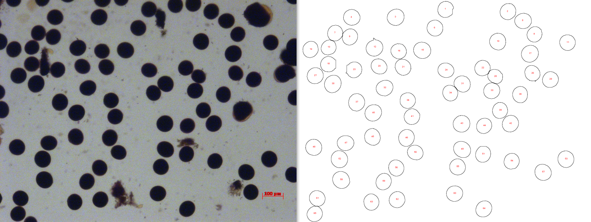

# 🌸 Pollen Diameter Calculator / 花粉直径计算器
# Pollen Diameter Batch Tool (ImageJ Macro)

[中文说明](#花粉粒直径批量统计工具imagej-宏)

This is a batch image-analysis macro for ImageJ / Fiji. It detects round black fertile pollen grains in microscope images, measures grain area, converts area to equivalent circular diameter, and exports Excel-readable CSV tables.

Script file:

```text
Pollen_Diameter_Batch.ijm
```

## Example

The example below shows an original rice pollen image with the generated outline preview.



## Features

- Batch-process JPG, JPEG, PNG, TIF, TIFF, and BMP images from one input folder.
- Use one fixed scale-bar calibration for the whole batch.
- Automatically detect the red scale-bar line from the first usable image.
- Search the full image width and the bottom region for the red scale bar.
- Allow manual scale input when automatic scale detection is unreliable.
- Use `Auto Best` to test Otsu, Default, and Huang threshold methods automatically.
- Separate touching or slightly overlapping pollen grains with ImageJ watershed.
- Calculate equivalent circular diameter from measured particle area.
- Filter pollen candidates by circularity, default `Circularity = 0.70-1.00`.
- Use Roundness and Solidity to reject elongated, clipped, indented, or damaged particles.
- Exclude nonblack candidates with an adjustable black-center filter.
- Exclude dark background interference using center-to-background contrast.
- Filter objects outside the adjustable diameter range, default `20-100 um`.
- Exclude particles touching the image edge.
- Export a main result table, particle detail table, summary table, and debug log.
- Optionally save candidate outlines, final filtered outlines, and binary mask previews.

## Requirements

- [ImageJ official download](https://imagej.net/ij/download.html) or [Fiji official download](https://imagej.net/software/fiji/downloads)

This tool is not a Python program. It is an ImageJ macro script with the `.ijm` extension.

## Usage

1. Download and open ImageJ or Fiji.
2. Go to `Plugins > Macros > Run...`.
3. Select `Pollen_Diameter_Batch.ijm`.
4. Choose the input folder containing pollen images.
5. Choose the output folder.
6. Set `Scale bar length (um)` to the number printed on the scale bar in the current image batch.
7. Confirm or adjust the remaining parameters.
8. Run the macro and wait for batch processing to finish.

The script does not have to be placed in the ImageJ `plugins` folder. You can keep it anywhere and run it through `Plugins > Macros > Run...`. Placing it in `plugins` only makes it easier to find later.

## Main Parameters

| Parameter | Default | Description |
| --- | ---: | --- |
| Scale bar length (um) | 100 | Real scale-bar length. Change this to the number printed on your image scale bar. The macro detects the red line but does not read the text label. |
| Manual pixels for scale bar | 0 | Use `0` for automatic detection from the first usable image, or enter a manually measured pixel length. |
| Valid diameter min (um) | 20 | Lower limit for the area-derived diameter; users can adjust it. |
| Valid diameter max (um) | 100 | Upper limit for the area-derived diameter; users can adjust it. |
| Auto threshold | Auto Best | Tries Otsu, Default, and Huang in sequence and selects the first method that produces plausible pollen candidates. |
| Red threshold min | 90 | Minimum red-channel value used to detect the red scale bar. |
| Green max for red | 130 | Maximum green-channel value for a red scale-bar pixel. |
| Blue max for red | 130 | Maximum blue-channel value for a red scale-bar pixel. |
| Search image width (%) | 100 | Searches the full image width for the red scale bar. |
| Search bottom side (%) | 35 | Searches the bottom 35% of the image for the scale bar. |
| Minimum scale bar pixels | 20 | Rejects short red labels or noise as scale-bar candidates. |
| Minimum circularity | 0.70 | Objects in `0.70-1.00` are accepted by the initial circularity filter. |
| Minimum roundness | 0.85 | Rejects elongated, clipped, half-round, or incomplete particles. |
| Minimum solidity | 0.94 | Rejects particles with dents, missing sectors, or damaged contours. |
| Black max intensity (RGB) | 90 | A pixel is black only when R, G, and B are all less than or equal to this value. |
| Minimum black center (%) | 95 | Minimum percentage of black pixels required in the inner sampled region. |
| Minimum center-background contrast | 35 | Rejects dark objects that are not sufficiently different from the surrounding background. |
| Save watershed preview PNG | Optional | Saves candidate outlines, final filtered outlines, and the selected binary mask. |
| Run in batch mode | Enabled | Processes images without displaying every intermediate image. |

`Triangle` and `Moments` are also available as manual threshold choices, but `Auto Best` tests Otsu, Default, and Huang because these methods performed more reliably in the current pollen-image tests.

## Automatic Threshold Selection

When `Auto threshold = Auto Best`, the macro evaluates threshold methods in this order:

```text
Otsu -> Default -> Huang
```

For each method, it checks whether the segmented objects produce plausible candidates according to:

- area-derived diameter range;
- Minimum circularity;
- Minimum roundness;
- Minimum solidity.

The first suitable method is used for the complete analysis of that image. The selected method is recorded in `pollen_particles_detail.csv`, `pollen_summary.csv`, and `pollen_debug_log.txt`.

## Diameter Calculation

The macro measures pollen grain area first, then converts area to equivalent circular diameter:

```text
diameter = sqrt(4 * area / pi)
```

This method is used because:

- pollen grains are usually close to circular, so area-derived diameter is stable;
- direct Feret diameter can be enlarged by rough edges, shadows, or slight contact between grains;
- area-derived diameter matches the common equivalent circular diameter calculation.

Feret diameter is still included in the particle detail table for manual quality control, but it is not the primary reported diameter.

## Fertile Black Pollen and Background Filter

A candidate is included in the final result only when:

- its area-derived diameter is within the configured range;
- its circularity is at or above the configured minimum;
- its Roundness is at or above the configured minimum;
- its Solidity is at or above the configured minimum;
- its black-center percentage is at or above the configured minimum;
- its center-to-background contrast is at or above the configured minimum;
- it does not touch the image edge.

The background contrast filter samples an annular region surrounding each candidate. Dark debris or dark background regions with insufficient contrast are marked as `background_interference`.

Rejected candidates remain in `pollen_particles_detail.csv` for review. Possible values in `Final_Status` include:

```text
valid
invalid_diameter
invalid_roundness
invalid_solidity
nonblack
background_interference
```

## Output Files

The output folder will contain:

```text
pollen_diameter_table.csv
pollen_particles_detail.csv
pollen_summary.csv
pollen_debug_log.txt
pollen_previews/
```

| File | Description |
| --- | --- |
| `pollen_diameter_table.csv` | Main wide table. Each image occupies three columns: particle index, area, and area-derived diameter. |
| `pollen_particles_detail.csv` | Per-particle details, including final status, threshold method, area-derived diameter, Feret diameter, shape measurements, color measurements, background contrast, coordinates, and scale information. |
| `pollen_summary.csv` | Per-image summary including selected threshold method, valid count, exclusion counts, mean diameter, standard deviation, minimum, and maximum. |
| `pollen_debug_log.txt` | Debug log for scale detection, automatic threshold selection, and segmentation. |
| `*_outlines.png` | All candidates after watershed and the initial circularity filter. |
| `*_filtered_watershed.png` | Only the final valid pollen contours and particle numbers. |
| `*_mask.png` | Binary mask produced by the selected threshold method. |

## Fixed Batch Calibration

- All images in one batch use the same scale-bar pixel value.
- In automatic mode, the first successfully detected red scale bar determines the fixed pixel value for the complete batch.
- The macro detects the red line but does not automatically read labels such as `50 um` or `100 um`.
- Set `Scale bar length (um)` to the value printed on the current image set.
- If automatic detection is inaccurate, measure the red line in ImageJ and enter its pixel length in `Manual pixels for scale bar`.
- Do not mix images acquired at different magnifications or exported at different sizes in one batch.

## Recommended Settings

```text
Scale bar length: match the number printed on the current image scale bar
Manual pixels for scale bar: 0 for automatic detection
Valid diameter min: 20 um
Valid diameter max: 100 um
Auto threshold: Auto Best
Minimum circularity: 0.70
Circularity range: 0.70-1.00
Minimum roundness: 0.85
Minimum solidity: 0.94
Red threshold min: 90
Black max intensity (RGB): 90
Minimum black center (%): 95
Minimum center-background contrast: 35
```

## Parameter Adjustment

- If too many true pollen grains are excluded, slightly lower `Minimum roundness`, `Minimum solidity`, or `Minimum center-background contrast`.
- If elongated, clipped, or damaged objects remain, increase `Minimum roundness` or `Minimum solidity`.
- If nonblack pollen is still counted, lower `Black max intensity (RGB)` or raise `Minimum black center (%)`.
- If true black fertile pollen is missed, raise `Black max intensity (RGB)` slightly or lower `Minimum black center (%)`.
- If background debris is included, raise `Minimum center-background contrast`.
- If scale detection is inaccurate, use manual scale-bar pixels.

## Notes

- Put only pollen images in the input folder.
- Do not mix screenshots, instruction images, or unrelated images into the input folder.
- Severely overlapping pollen grains may not be perfectly separated; use the preview images for manual checking.
- The `20-100 um` diameter range is a default and should be adjusted for different plant species or experimental materials.
- The final counted particles are determined by `Final_Status = valid`, not only by the raw outline preview.
- Always review the binary mask and final filtered preview before formal statistical analysis.

## GitHub

Open-source repository:

[cong2774/Pollen-diameter-calculation](https://github.com/cong2774/Pollen-diameter-calculation)

---

# 花粉粒直径批量统计工具（ImageJ 宏）

[English](#pollen-diameter-batch-tool-imagej-macro)

这是一个用于 ImageJ / Fiji 的批量花粉图片分析宏脚本。它能够自动识别显微图片中较圆、全黑的可育花粉粒，测量颗粒面积，根据面积反推等效圆直径，并导出 Excel 可以直接打开的 CSV 表格。

脚本文件：

```text
Pollen_Diameter_Batch.ijm
```

## 示例图片

下图展示了原始水稻花粉图片和程序生成的轮廓预览结果。


## 功能特点

- 批量处理一个文件夹内的 JPG、JPEG、PNG、TIF、TIFF 和 BMP 图片。
- 对整批图片使用同一个固定标尺标定值。
- 从第一张可用图片中自动识别红色标尺横线。
- 在整张图片宽度和底部区域内搜索红色标尺。
- 支持人工输入标尺像素值，避免自动标尺识别失败或不稳定。
- 使用 `Auto Best` 自动测试 Otsu、Default 和 Huang 阈值方法。
- 使用 ImageJ 分水岭分离相互接触或轻微重叠的花粉粒。
- 根据颗粒面积反推等效圆直径。
- 使用圆度筛选花粉粒，默认 `Circularity = 0.70-1.00`。
- 使用 Roundness 和 Solidity 排除拉长、截断、有缺口或轮廓损伤的颗粒。
- 使用中心黑色像素比例排除颜色不够黑的候选花粉。
- 使用中心与周围背景对比度排除黑色背景干扰。
- 过滤超出合理直径范围的对象，默认范围为 `20-100 um`。
- 自动排除接触图片边缘的不完整颗粒。
- 导出主结果表、逐粒明细表、图片汇总表和调试日志。
- 可保存候选轮廓、最终有效轮廓和二值掩膜预览图。

## 软件要求

- [ImageJ 官方下载](https://imagej.net/ij/download.html) 或 [Fiji 官方下载](https://imagej.net/software/fiji/downloads)

本工具不是 Python 程序，而是 ImageJ 宏脚本，文件后缀为 `.ijm`。

## 使用方法

1. 下载并打开 ImageJ 或 Fiji。
2. 点击 `Plugins > Macros > Run...`。
3. 选择 `Pollen_Diameter_Batch.ijm`。
4. 选择花粉图片所在文件夹。
5. 选择结果输出文件夹。
6. 将 `Scale bar length (um)` 设置为当前批次图片标尺上实际标注的数值。
7. 确认或修改其余参数。
8. 点击运行，等待批量处理完成。

脚本文件不一定要放在 ImageJ 的 `plugins` 文件夹中。放在任意位置也可以通过 `Plugins > Macros > Run...` 运行；放入 `plugins` 文件夹只是为了以后更方便找到。

## 主要参数

| 参数 | 默认值 | 说明 |
| --- | ---: | --- |
| Scale bar length (um) | 100 | 标尺实际长度。请填写当前图片标尺上标注的数值。程序识别红色横线，但不会读取标尺文字。 |
| Manual pixels for scale bar | 0 | 填 `0` 表示从第一张可用图片中自动识别，也可以输入人工测量的像素长度。 |
| Valid diameter min (um) | 20 | 面积反推直径的合理范围下限，用户可自行调整。 |
| Valid diameter max (um) | 100 | 面积反推直径的合理范围上限，用户可自行调整。 |
| Auto threshold | Auto Best | 依次测试 Otsu、Default 和 Huang，并选择第一个能够获得合理候选花粉的方法。 |
| Red threshold min | 90 | 用于识别红色标尺的红色通道最低值。 |
| Green max for red | 130 | 红色标尺像素中绿色通道的最大值。 |
| Blue max for red | 130 | 红色标尺像素中蓝色通道的最大值。 |
| Search image width (%) | 100 | 在整张图片宽度内搜索红色标尺。 |
| Search bottom side (%) | 35 | 在图片底部 35% 区域搜索标尺。 |
| Minimum scale bar pixels | 20 | 排除过短的红色文字或噪声。 |
| Minimum circularity | 0.70 | Circularity 初步筛选范围为 `0.70-1.00`。 |
| Minimum roundness | 0.85 | 排除明显拉长、截断、半圆或不完整的颗粒。 |
| Minimum solidity | 0.94 | 排除带缺口、缺失区域或轮廓损伤的颗粒。 |
| Black max intensity (RGB) | 90 | 只有 R、G、B 都小于或等于该值时，才判定为黑色像素。 |
| Minimum black center (%) | 95 | 候选花粉内部采样区域所需的最低黑色像素比例。 |
| Minimum center-background contrast | 35 | 排除与周围背景亮度差不足的黑色干扰物。 |
| Save watershed preview PNG | 可选 | 保存候选轮廓、最终有效轮廓和自动阈值二值掩膜。 |
| Run in batch mode | 默认开启 | 批量处理时不显示每一个中间图像。 |

参数窗口中还可以人工选择 `Triangle` 和 `Moments`，但目前的 `Auto Best` 只依次测试 Otsu、Default 和 Huang，因为这3种方法在现有花粉图片测试中更稳定。

## 自动阈值选择

当 `Auto threshold = Auto Best` 时，程序按照以下顺序测试：

```text
Otsu -> Default -> Huang
```

程序会根据以下条件判断该阈值方法能否产生合理花粉候选物：

- 面积反推直径范围；
- Minimum circularity；
- Minimum roundness；
- Minimum solidity。

程序使用第一个满足条件的方法完成当前图片的正式分析。最终选择的阈值方法会写入 `pollen_particles_detail.csv`、`pollen_summary.csv` 和 `pollen_debug_log.txt`。

## 直径计算方法

本工具先统计花粉粒面积，再根据面积反推等效圆直径：

```text
diameter = sqrt(4 * area / pi)
```

选择该方法的原因：

- 花粉粒通常接近圆形，面积反推直径更加稳定；
- Feret 直径容易受边缘毛刺、阴影或轻微接触影响而偏大；
- 面积反推直径与常见的等效圆直径计算方法一致。

明细表中仍保留 Feret 直径，方便人工质量控制，但 Feret 直径不是最终主要统计直径。

## 可育黑色花粉与背景筛选

只有同时满足以下条件的颗粒才会进入最终统计：

- 面积反推直径位于设定范围内；
- Circularity 达到设定下限；
- Roundness 达到设定下限；
- Solidity 达到设定下限；
- 中心黑色像素比例达到设定下限；
- 中心与周围背景对比度达到设定下限；
- 颗粒不接触图片边缘。

背景对比度筛选会在每个候选颗粒外部采样一圈环形区域。如果深色杂质与周围背景的差异不足，会被标记为 `background_interference`。

被筛除的候选颗粒仍会保留在 `pollen_particles_detail.csv` 中，方便人工复核。`Final_Status` 的常见状态包括：

```text
valid
invalid_diameter
invalid_roundness
invalid_solidity
nonblack
background_interference
```

## 输出文件

运行结束后，输出文件夹中会生成：

```text
pollen_diameter_table.csv
pollen_particles_detail.csv
pollen_summary.csv
pollen_debug_log.txt
pollen_previews/
```

| 文件 | 说明 |
| --- | --- |
| `pollen_diameter_table.csv` | 横向主结果表，每张图片占3列：颗粒序号、面积和面积反推直径。 |
| `pollen_particles_detail.csv` | 逐粒明细，包含最终状态、阈值方法、面积直径、Feret 直径、形状指标、颜色指标、背景对比度、坐标和标尺信息。 |
| `pollen_summary.csv` | 每张图片的汇总结果，包括所选阈值方法、有效数量、各类剔除数量、平均直径、标准差、最小值和最大值。 |
| `pollen_debug_log.txt` | 标尺识别、自动阈值选择和图像分割的调试日志。 |
| `*_outlines.png` | 分水岭和 Circularity 初筛后的全部候选轮廓。 |
| `*_filtered_watershed.png` | 只显示最终有效花粉的轮廓和编号。 |
| `*_mask.png` | 所选自动阈值方法生成的二值掩膜。 |

## 整批固定标尺

- 同一批图片统一使用同一个标尺像素值。
- 自动模式以第一张成功识别红色标尺的图片作为整批固定标定依据。
- 程序只识别红色横线，不会自动读取旁边的 `50 um` 或 `100 um` 文字。
- `Scale bar length (um)` 必须填写当前图片标尺上实际标注的数值。
- 自动识别不准确时，可在 ImageJ 中人工测量红色横线的像素长度，再填入 `Manual pixels for scale bar`。
- 不要将不同显微镜倍数或不同导出尺寸的图片放在同一批次中。

## 推荐参数

```text
Scale bar length: 与当前图片标尺上标注的长度一致
Manual pixels for scale bar: 自动识别填 0
Valid diameter min: 20 um
Valid diameter max: 100 um
Auto threshold: Auto Best
Minimum circularity: 0.70
Circularity range: 0.70-1.00
Minimum roundness: 0.85
Minimum solidity: 0.94
Red threshold min: 90
Black max intensity (RGB): 90
Minimum black center (%): 95
Minimum center-background contrast: 35
```

## 参数调整建议

- 完整花粉被筛除过多：适当降低 `Minimum roundness`、`Minimum solidity` 或 `Minimum center-background contrast`。
- 拉长、截断或轮廓破损的对象仍被计入：提高 `Minimum roundness` 或 `Minimum solidity`。
- 颜色不够黑的花粉仍被计入：降低 `Black max intensity (RGB)` 或提高 `Minimum black center (%)`。
- 真实黑色可育花粉被漏掉：适当提高 `Black max intensity (RGB)` 或降低 `Minimum black center (%)`。
- 背景黑色杂质仍被计入：提高 `Minimum center-background contrast`。
- 标尺自动识别不准确：改用人工标尺像素长度。

## 注意事项

- 建议输入文件夹中只放待分析的花粉图片。
- 不要混入说明图、截图或其他无关图片。
- 如果花粉粒严重重叠，分水岭可能无法完全正确分开，需要结合预览图人工判断。
- 默认直径范围 `20-100 um` 可根据不同植物种类或实验材料自行调整。
- 最终是否进入统计以 `Final_Status = valid` 为准，不能只根据原始候选轮廓判断。
- 正式统计前建议同时检查二值掩膜和最终有效轮廓预览。

## GitHub

开源地址：

[cong2774/Pollen-diameter-calculation](https://github.com/cong2774/Pollen-diameter-calculation)
